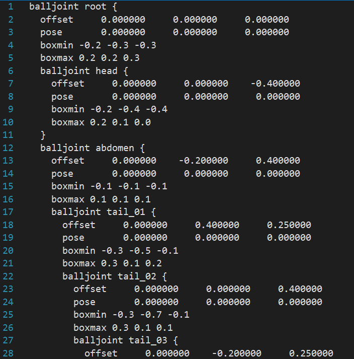

# Animation Project: Skeleton

This computer animation project consists of three parts: 
 
[Part1: Skeleton](https://github.com/mleonova/Graphics-Part1-Skeleton)
 
[Part 2: Skinning](https://github.com/mleonova/Graphics-Part2-Skinning) 
 
[Part 3: Animation](https://github.com/mleonova/Graphics-Part3-Animation)

## Objectives
The main objectives of Part 1 are:

1. Loading and parsing a text file (.skel) that describes the skeleton of an object.
2. Posing and displaying the skeleton.

## Background
In computer animation, a skeleton, also known as a rig, acts as an invisible framework that supports and controls the movement of characters or objects. It resembles a tree-like structure, with interconnected joints forming a hierarchy.

The skeleton starts with a root joint located at the character's hip or base. From there, additional joints branch out, creating a network of connections.

Joints function as pivotal points, much like the joints in our own bodies. They provide the ability to move and flex, allowing animators to manipulate and animate characters with ease. By adjusting the position, rotation, and size of these joints, a wide range of poses and movements can be achieved.

Each joint possesses what we call "degrees of freedom." This refers to the various directions in which a joint can move within certain limits. For instance, some joints, like ball-and-socket joints, allow for free rotation in multiple directions, while others, like hinge joints, only allow movement along a single axis.

The hierarchical structure of the skeleton, where the movement of a parent joint influences the movement of its child joints, ensures that motion is coordinated and realistic across the character or object. In simpler terms, it means that when one joint moves, it affects the movement of the joints connected to it, creating a natural and harmonious animation.

For instance, if we were to create a skeleton file for Olaf, the approximate hierarchy would look as follows:


## Skeleton file

Below is a snippet of the .skel file with explanation. 

#### ```offset x y z (joint offset vector)```
In animation, the "offset" in a skeleton file refers to the initial position and orientation of a joint relative to its parent joint. It determines how a joint is positioned and rotated when the animation begins.

For example, in a character's arm, the offset values define the initial position and rotation of the elbow joint relative to the shoulder joint. Similarly, the offset of the wrist joint determines its initial position and rotation relative to the elbow joint.

#### ```boxmin x y z (min corner of box to draw)``` and ```boxmax x y z (max corner of box to draw)```

In animation, "boxmin" and "boxmax" in a skeleton file represent the minimum and maximum coordinates of a bounding box that encloses specific joints or joint collections within a character model. These values define the spatial boundaries for proper positioning and size during animations.

For example, let's consider a character's hand. The boxmin and boxmax values in the skeleton file would define the minimum and maximum coordinates of a bounding box that encapsulates the hand joints. This bounding box helps determine the spatial boundaries of the hand's position and size. By specifying the boxmin and boxmax values accurately, animators can ensure that the character's hand remains within the designated bounding box during animations. It helps maintain the proper spatial constraints and prevent any unwanted intersections or penetrations between different parts of the character model.

#### ```rotxlimit min max (x rotation DOF limits)``` and ```rotylimit min max (y rotation DOF limits)``` and ```rotzlimit min max (z rotation DOF limits)``

In a skeleton file for animation, "rotxlimit," "rotylimit," and "rotzlimit" define the rotational limits or constraints for a joint's movement around the X, Y, and Z axes respectively.

For example, let's consider a character's leg joint. The rotxlimit value would specify the maximum and minimum rotation angles allowed around the X-axis for that joint. This limits how far the leg can rotate forward or backward.

Similarly, the rotylimit value would define the rotational constraints around the Y-axis, limiting the sideways movement of the leg joint. The rotzlimit value would constrain the rotation around the Z-axis, controlling any twisting motion.

#### ```pose x y z (values to pose DOFs)```

In a skeleton file for animation, a "pose" refers to the specific configuration or arrangement of the joints in the skeleton at a given moment. It defines the position and rotation of each joint, capturing a snapshot of the character's posture or stance.

For example, let's consider a character's walking animation. Each frame of the animation would have a corresponding pose defined in the skeleton file. The pose would specify the position and orientation of the character's joints, such as the position of the legs, arms, and head at that particular frame.

#### ```balljoint name { } (child joint)```


In a skeleton file for animation, a "balljoint" refers to a type of joint that allows rotational movement in multiple directions, similar to a ball-and-socket joint in our own bodies. This joint is often used to establish a parent-child relationship between joints in the skeletal hierarchy.

For example, let's consider a character's arm. If the shoulder joint is defined as a balljoint in the skeleton file, it signifies that the shoulder can rotate freely, acting as the parent joint. The child joints, such as the elbow and wrist, are connected to the shoulder joint, inheriting its rotational movement.





## Demo

https://user-images.githubusercontent.com/30246711/225461306-ea8bf8a2-7735-46b4-a15b-7bd7c27a431c.mp4


https://user-images.githubusercontent.com/30246711/225461846-06bb0371-e20d-4748-84d1-c58e119d1e54.mp4


https://user-images.githubusercontent.com/30246711/225462101-b883f844-67cc-4750-908e-ba843d409b0d.mp4

