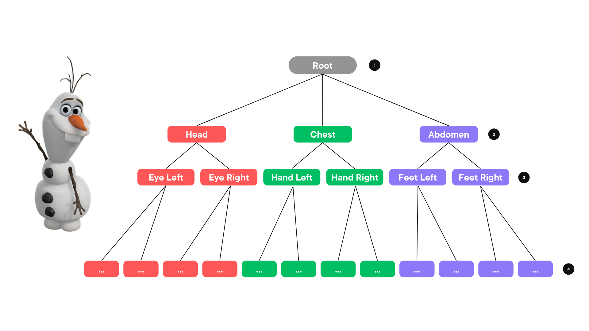

# Animation Project: Skeleton

This computer animation project consists of three parts: 
 
[Part1: Skeleton](https://github.com/mleonova/Graphics-Part1-Skeleton)
 
[Part 2: Skinning](https://github.com/mleonova/Graphics-Part2-Skinning) 
 
[Part 3: Animation](https://github.com/mleonova/Graphics-Part3-Animation)

## Objectives
The main objectives of Part 1 are:

1. Loading and parsing a text file (.skel) that describes the skeleton of an object.
2. Posing and displaying the skeleton.

## Background
In computer animation, a skeleton, also known as a rig, acts as an invisible framework that supports and controls the movement of characters or objects. It resembles a tree-like structure, with interconnected joints forming a hierarchy.

The skeleton starts with a root joint located at the character's hip or base. From there, additional joints branch out, creating a network of connections.

Joints function as pivotal points, much like the joints in our own bodies. They provide the ability to move and flex, allowing animators to manipulate and animate characters with ease. By adjusting the position, rotation, and size of these joints, a wide range of poses and movements can be achieved.

Each joint possesses what we call "degrees of freedom." This refers to the various directions in which a joint can move within certain limits. For instance, some joints, like ball-and-socket joints, allow for free rotation in multiple directions, while others, like hinge joints, only allow movement along a single axis.

The hierarchical structure of the skeleton, where the movement of a parent joint influences the movement of its child joints, ensures that motion is coordinated and realistic across the character or object. In simpler terms, it means that when one joint moves, it affects the movement of the joints connected to it, creating a natural and harmonious animation.

If we were to create a skeleton file for Olaf, the approximate hierarchy would look as follows:

## Skeleton file

## Demo

https://user-images.githubusercontent.com/30246711/225461306-ea8bf8a2-7735-46b4-a15b-7bd7c27a431c.mp4

https://user-images.githubusercontent.com/30246711/225461846-06bb0371-e20d-4748-84d1-c58e119d1e54.mp4

https://user-images.githubusercontent.com/30246711/225462101-b883f844-67cc-4750-908e-ba843d409b0d.mp4

